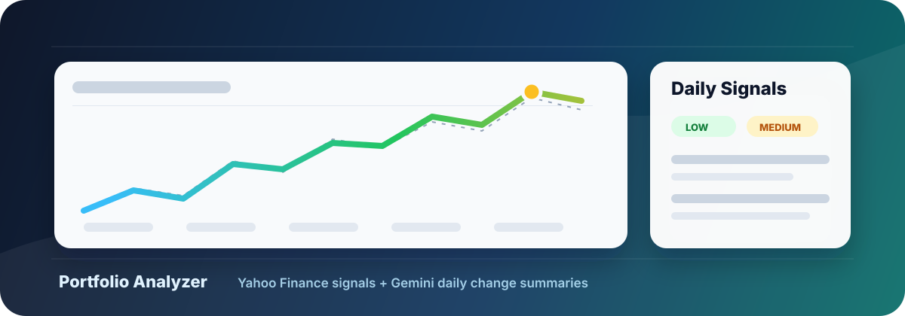

# Portfolio Analyzer



A standalone Python script that monitors a personal stock watchlist, collects market context from Yahoo Finance, asks an AI model what materially changed, and optionally emails a copy-ready daily report through Gmail SMTP.

The project does not read any portfolio CSV. The watchlist is created and maintained with `--add` and `--remove`.

## What It Does

- Validates tickers against Yahoo Finance before adding them.
- Allows NYSE and Nasdaq equities.
- Stores the watchlist locally in `portfolio_monitor_state/watchlist.json`.
- Collects price, volume, fundamentals, news, earnings dates, SEC filing, analyst, insider, valuation, technical, sector, and corporate action context.
- Detects explicit breaks above or below the 50-day moving average.
- Uses Gemini or Cline to summarize what changed without making buy/sell/hold recommendations.
- Processes multiple tickers concurrently for faster daily runs.
- Sorts the final report by priority from `HIGH` to `MEDIUM` to `LOW`.
- Sends a single copy-ready HTML email with light color emphasis for readability.

## Setup

Create a virtual environment and install dependencies:

```bash
python3 -m venv .venv
source .venv/bin/activate
pip install -r requirements.txt
```

Create `.env` in the project folder:

```env
AI_PROVIDER=cline
AI_MODEL=google/gemini-2.5-pro
CLINE_API_KEY=your_cline_api_key_here
GEMINI_API_KEY=your_direct_gemini_fallback_key_here
SENDER_EMAIL=your-email@gmail.com
RECIPIENTS=first@example.com,second@example.com
```

`AI_PROVIDER` can be `cline` or `gemini`. If it is omitted, the script uses `cline`.

The default Cline model is `google/gemini-2.5-pro`, which uses Cline credits. Direct Gemini is treated as the fallback path.

For Cline:

```env
AI_PROVIDER=cline
AI_MODEL=google/gemini-2.5-pro
CLINE_API_KEY=your_cline_api_key_here
```

For direct Gemini:

```env
AI_PROVIDER=gemini
AI_MODEL=gemini-3.7-flash
GEMINI_API_KEY=your_gemini_api_key_here
```

If Cline is selected and `CLINE_API_KEY` is missing or fails, the script tries direct Gemini when `GEMINI_API_KEY` is configured. If no AI provider is available, it falls back to deterministic summaries.

`SENDER_EMAIL` and `RECIPIENTS` are required only when using `--email`.

## Gmail email

Email sending uses Gmail SMTP with an App Password (no OAuth, no Google Cloud project).

Add to `.env`:

- `SENDER_EMAIL`: the sending Gmail address
- `GMAIL_APP_PASSWORD`: a 16-char App Password from <https://myaccount.google.com/apppasswords> (requires 2-Step Verification)
- `RECIPIENTS`: comma-separated recipient list

Verify with:

```bash
python3 authenticate_gmail.py
```

For the full setup flow, see [GMAIL_API_SETUP.md](GMAIL_API_SETUP.md).

`.env` holds secrets and is ignored by Git.

## Watchlist Commands

Add tickers:

```bash
python3 portfolio_monitor.py --add RTX --add SNDK
```

Remove a ticker:

```bash
python3 portfolio_monitor.py --remove RTX
```

List current tickers:

```bash
python3 portfolio_monitor.py --list
```

Adding the same ticker more than once is safe. The watchlist is saved without duplicates.

## Run The Monitor

Print a report in the terminal:

```bash
python3 portfolio_monitor.py
```

Send the report by email:

```bash
python3 portfolio_monitor.py --email
```

Run without Gemini:

```bash
python3 portfolio_monitor.py --skip-ai
```

Use a different AI provider or model:

```bash
python3 portfolio_monitor.py --ai-provider cline --model google/gemini-2.5-pro
```

Change the one-day price move threshold:

```bash
python3 portfolio_monitor.py --price-threshold 4
```

Tune concurrent ticker processing:

```bash
python3 portfolio_monitor.py --max-concurrent-tickers 4
```

## Report Format

The email is HTML, but the report body is intentionally one continuous text block so it can be copied into another AI chat.

Tickers are sorted by urgency, with `HIGH` priority items first.

The HTML version adds light visual emphasis:

- Ticker names and priority values are colored by urgency.
- Section headers are bold and colored.
- Positive percentages are green.
- Negative percentages are red.

The plain-text email body remains plain text.

## Detectors

The script currently collects these detector groups from Yahoo Finance / yfinance:

- `Analyst Revisions`: EPS revisions, EPS trends, recommendation summaries, price targets, upgrades, and downgrades.
- `Insider Transactions`: recent insider transaction and purchase data when Yahoo provides it.
- `SEC Filings`: recent SEC filing metadata exposed by Yahoo.
- `Valuation Changes`: valuation metrics and analyst target gap versus the latest close.
- `Technical Indicators`: 20 DMA, 50 DMA, 50 DMA breaks, RSI, volatility, and distance from yearly high/low.
- `Sector Performance`: 5-day relative move versus a sector ETF proxy.
- `Corporate Actions`: recent dividends and splits.
- `News Relevance`: lightweight headline classification by topic.

Yahoo coverage varies by ticker. Some detector groups may be empty for some symbols.

## Local State

Generated state lives under:

```text
portfolio_monitor_state/
```

It contains:

- `watchlist.json`: saved tickers.
- `snapshots/`: prior fundamental snapshots used for change detection.
- `raw/`: latest structured context per ticker.
- `reports/`: saved report payloads.

This directory is ignored by Git.

## Server Cron Example

Example cron for running at 14:00 Israel time, Monday through Friday:

```cron
CRON_TZ=Asia/Jerusalem
0 14 * * 1-5 /root/scripts/portfolio_analyzer/.venv/bin/python /root/scripts/portfolio_analyzer/portfolio_monitor.py --email >> /root/scripts/portfolio_analyzer/cron.log 2>&1
```
